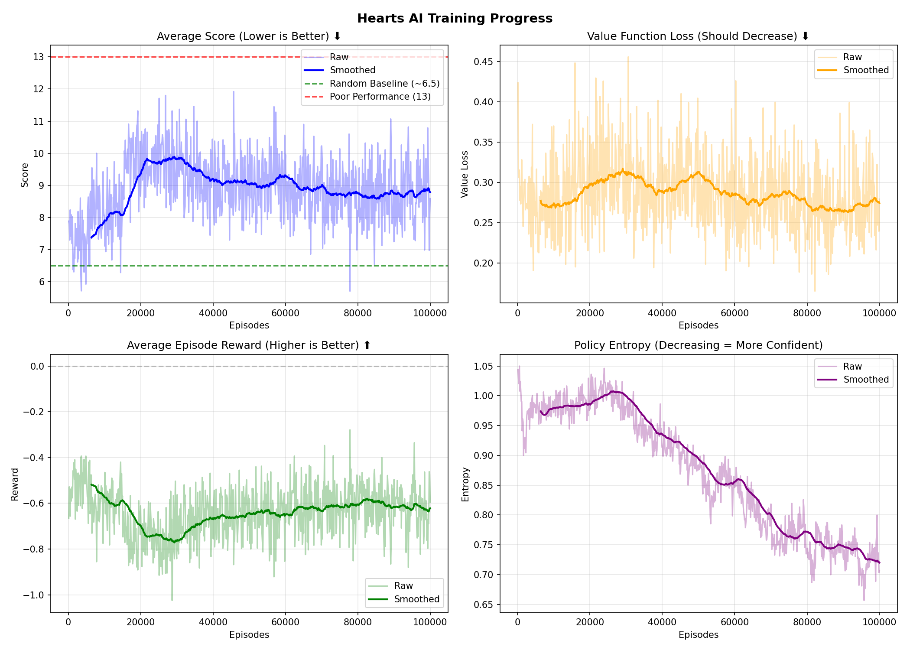

# Hearts AI 🃏

基于 **LSTM + PPO** 的红心大战 (Hearts) 人工智能，使用深度强化学习训练 AI 玩家。

## 项目概述

Hearts 是一款经典的四人扑克牌游戏，目标是尽可能少得分（红心牌和黑桃Q会得分）。本项目实现了：

1. **完整的 Hearts 游戏引擎** - 支持换牌阶段和出牌阶段
2. **基于 LSTM 的神经网络** - 利用时序信息学习出牌策略
3. **独立的换牌网络** - 专门学习如何选择换牌
4. **DAgger + PPO 混合训练** - 先模仿学习，再强化学习优化

## 架构设计

### 1. 出牌网络 (HeartsLSTM)

```
输入特征 (375维):
├── 手牌 (52) - 当前持有的牌
├── 桌面牌 (52) - 当前轮次已出的牌
├── 我的历史 (52) - 我已经打出的牌
├── 他人历史 (52) - 其他人打出的牌
├── 分数 (4) - 四个玩家的当前得分
├── 当前轮信息 (6) - 红心/SQ状态、排名等
├── 危险牌状态 (3) - SQ/SK/SA是否已出
├── 花色计数 (4) - 我手中各花色数量
├── 缺门推断 (16) - 推断其他玩家缺什么花色
├── 传出的牌 (52) - 换牌阶段我传出的牌
├── 收到的牌 (52) - 换牌阶段我收到的牌
├── 传牌方向 (4) - LEFT/RIGHT/ACROSS/KEEP
├── 对手花色估计 (12) - 估计对手各花色剩余数量
├── SQ位置概率 (4) - 黑桃Q在各玩家手中的概率
├── 当前轮赢家预测 (4)
├── 游戏进度 (1)
├── 各花色剩余牌数 (4)
└── 风险分数 (1) - 当前轮有多少分

网络结构:
Input(375) → Embed(512) → LSTM(512, 2层) → Policy(52) + Value(1) + AuxHeads
```

### 2. 换牌网络 (PassingNetwork)

```
输入特征 (108维):
├── 手牌 (52) - 初始13张牌
├── 已选牌 (52) - 已经选择要传的牌
└── 传牌方向 (4) - LEFT/RIGHT/ACROSS/KEEP

网络结构:
Input(108) → MLP(256, 3层) → CardScores(52) + Value(1)

顺序选择3张牌 (考虑依赖关系)
```

## 训练流程

### Phase 1: DAgger 模仿学习预训练
- 模仿专家策略 (ExpertPolicy) 的决策
- 快速建立基础能力
- 目标: 出牌准确率 > 95%, 换牌准确率 > 99%

### Phase 2: PPO 强化学习微调
- 通过自我博弈和对抗专家进行优化
- Curriculum Learning: Random → Mixed → Expert 对手
- 目标: 平均得分 < 6.5 (击败专家)

## 文件结构

```
Hearts/
├── config.py           # 超参数配置
├── data_structure.py   # Card, Suit, Player 等数据结构
├── game.py             # Hearts 游戏引擎
├── strategies.py       # 规则策略 (Expert, Random)
├── model.py            # HeartsLSTM 神经网络
├── passing_model.py    # PassingNetwork 换牌网络
├── agent.py            # 智能体封装 (状态预处理、动作选择)
├── passing_agent.py    # 换牌智能体
├── pretrain.py         # DAgger 预训练 (出牌)
├── pretrain_passing.py # DAgger 预训练 (换牌)
├── pretrain_joint.py   # 联合预训练
├── train.py            # PPO 训练 (仅出牌)
├── train_joint.py      # PPO 联合训练 (出牌+换牌)
├── main.py             # 入口脚本 (pretrain/train/eval)
├── plot_training.py    # 训练曲线可视化
└── output/             # 模型和日志输出
```

## 使用方法

```bash
# 1. 预训练 (DAgger模仿学习)
python main.py pretrain

# 2. 强化学习训练 (PPO)
python main.py train

# 3. 评估模型
python main.py eval
```

## 训练结果



## 关键技术点

### 特征工程
- **缺门推断**: 通过历史出牌推断对手缺什么花色
- **换牌信息传递**: 让出牌网络知道换牌阶段发生了什么
- **SQ追踪**: 辅助任务预测黑桃Q位置

### 训练技巧
- **DAgger**: 解决分布偏移问题，比纯行为克隆更稳定
- **Curriculum Learning**: 渐进式增加对手难度
- **PPO Clipping**: 防止策略更新过大导致崩溃

### 专家策略增强
- ExpertPolicy 利用收到的换牌信息调整策略
- 优先处理危险牌 (收到的高分牌)

## 依赖

```
torch >= 2.0
numpy
matplotlib
```

## TODO

- [ ] 添加 Web UI 可视化
- [ ] 支持人机对战
- [ ] 尝试 Transformer 替代 LSTM
